# SentinelPay Payment Transaction Flow

This diagram represents the current payment flow, including PostgreSQL transaction boundaries, SQS delivery, PSP processing, reservations, retries, and final settlement.

```mermaid
flowchart TD
    customer["Customer"]
    sqs["AWS SQS<br/>at-least-once delivery"]
    psp["External PSP"]
    wait["Payment waits in PROCESSING<br/>reservation remains ACTIVE"]

    customer -->|"POST /payments"| createStart

    subgraph tx1["TX1 — Create payment"]
        direction TB
        createStart["PaymentController"]
        createService["PaymentService"]
        checkIdempotency["Check request idempotency key"]
        insertPayment["Insert Payment<br/>status = CREATED"]
        insertOutbox["Insert PAYMENT_CREATED<br/>outbox event"]
        createCommit["COMMIT"]

        createStart --> createService
        createService --> checkIdempotency
        checkIdempotency --> insertPayment
        insertPayment --> insertOutbox
        insertOutbox --> createCommit
    end

    createCommit -->|"Return payment"| customer
    createCommit --> pendingOutbox

    subgraph publishing["Outbox publishing — DB and SQS cannot share a transaction"]
        direction TB
        pendingOutbox["OutboxPublisher reads<br/>unpublished events"]
        sendSqs["Send event to SQS"]
        markPublished["Mark outbox row published"]

        pendingOutbox --> sendSqs
        sendSqs --> markPublished
    end

    sendSqs --> sqs
    sqs -->|"Deliver PAYMENT_CREATED"| claimStart

    subgraph tx2["TX2 — Reserve funds and claim provider lease"]
        direction TB
        claimStart["PaymentEventConsumer"]
        checkProcessed["Check processed_events"]
        lockPayment["Lock Payment FOR UPDATE"]
        approve["Temporary screening<br/>CREATED → SCREENING → APPROVED"]
        lockWallets["Lock wallets in UUID order"]
        validateMoney["Validate currency and<br/>available balance"]
        reserveFunds["Increase reserved_balance<br/>Insert ACTIVE reservation"]
        processing["Payment → PROCESSING"]
        claimLease["Create or claim<br/>provider_attempt lease"]
        claimCommit["COMMIT"]

        claimStart --> checkProcessed
        checkProcessed --> lockPayment
        lockPayment --> approve
        approve --> lockWallets
        lockWallets --> validateMoney
        validateMoney --> reserveFunds
        reserveFunds --> processing
        processing --> claimLease
        claimLease --> claimCommit
    end

    claimCommit -->|"Outside every DB transaction<br/>payment UUID = idempotency key"| psp

    psp -->|"ACCEPTED + providerPaymentId"| completeStart

    subgraph tx3["TX3 — Record PSP acceptance"]
        direction TB
        completeStart["Lock payment"]
        lockAttempt["Lock provider_attempt"]
        verifyLease["Verify lease token ownership"]
        saveProviderId["Store providerPaymentId"]
        completeAttempt["Mark provider attempt COMPLETED"]
        markProcessed["Insert processed_events marker"]
        completeCommit["COMMIT"]

        completeStart --> lockAttempt
        lockAttempt --> verifyLease
        verifyLease --> saveProviderId
        saveProviderId --> completeAttempt
        completeAttempt --> markProcessed
        markProcessed --> completeCommit
    end

    completeCommit --> wait

    psp -->|"Signed final webhook"| verifyWebhook
    wait --> verifyWebhook

    verifyWebhook["WebhookController verifies<br/>timestamp + HMAC over raw body"]

    verifyWebhook -->|"SUCCEEDED"| successStart
    verifyWebhook -->|"DECLINED"| declineStart

    subgraph tx4["TX4 — Successful settlement"]
        direction TB
        successStart["Lock payment by providerPaymentId"]
        claimSuccessEvent["Claim webhook event ID"]
        lockSuccessMoney["Lock wallets and ACTIVE reservation"]
        validateSettlement["Validate payment amount<br/>wallets and currency"]
        ledgerTransaction["Insert unique ledger transaction<br/>linked to payment ID"]
        debitEntry["Sender ledger entry: -amount"]
        creditEntry["Receiver ledger entry: +amount"]
        capture["Decrease sender balance<br/>Decrease reserved_balance<br/>Credit receiver"]
        settled["Reservation → CAPTURED<br/>Payment → SETTLED"]
        successCommit["COMMIT"]

        successStart --> claimSuccessEvent
        claimSuccessEvent --> lockSuccessMoney
        lockSuccessMoney --> validateSettlement
        validateSettlement --> ledgerTransaction
        ledgerTransaction --> debitEntry
        ledgerTransaction --> creditEntry
        debitEntry --> capture
        creditEntry --> capture
        capture --> settled
        settled --> successCommit
    end

    subgraph tx5["TX5 — Declined payment"]
        direction TB
        declineStart["Lock payment and claim webhook"]
        lockDeclineMoney["Lock sender wallet<br/>and ACTIVE reservation"]
        releaseFunds["Decrease reserved_balance<br/>posted balance unchanged"]
        failed["Reservation → RELEASED<br/>Payment → FAILED"]
        declineCommit["COMMIT"]

        declineStart --> lockDeclineMoney
        lockDeclineMoney --> releaseFunds
        releaseFunds --> failed
        failed --> declineCommit
    end

    psp -->|"TIMEOUT or unknown result"| timeoutStart

    subgraph tx6["TX6 — Record retryable failure"]
        direction TB
        timeoutStart["Lock payment and provider attempt"]
        releaseLease["Release local attempt lease"]
        retainReservation["Keep reservation ACTIVE<br/>Keep Payment PROCESSING"]
        noCompletion["Do not insert processed_events"]
        timeoutCommit["COMMIT"]

        timeoutStart --> releaseLease
        releaseLease --> retainReservation
        retainReservation --> noCompletion
        noCompletion --> timeoutCommit
    end

    timeoutCommit -->|"SQS message is not deleted"| sqs
```



## Critical transaction boundary

The most important boundary is:

```text
TX2 COMMIT
    ↓
PSP NETWORK CALL
    ↓
TX3 COMMIT
```

The PSP call is intentionally outside a database transaction. PostgreSQL cannot include an external company's system in its commit or rollback.

That creates an uncertainty window:

```text
PSP accepts payment
→ SentinelPay crashes before TX3
→ SentinelPay does not know whether PSP accepted it
```

The reservation, lease, and idempotency key work together to handle that window:

```text
Reservation     → money remains available for this payment
Lease           → normally only one worker calls the PSP
Idempotency key → a retry cannot create another PSP payment
```

## Transaction guarantees

| Transaction | Atomic guarantee |
|---|---|
| TX1 | Payment and outbox event both exist or neither exists |
| TX2 | Reservation, `PROCESSING`, and provider lease commit together |
| TX3 | Provider ID and message-completion marker commit together |
| TX4 | Ledger entries, balances, reservation capture, and `SETTLED` commit together |
| TX5 | Reservation release and `FAILED` commit together |
| TX6 | Retry lease is released while the money reservation remains held |

The system uses at-least-once delivery. It accepts duplicate message delivery while preventing duplicate business effects through event deduplication, leases, stable provider idempotency keys, row locks, state validation, and unique database constraints.
